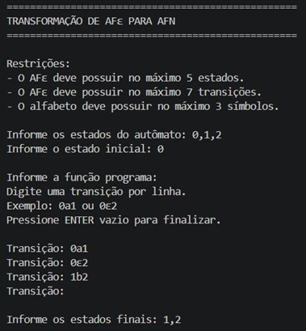
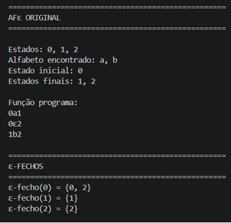
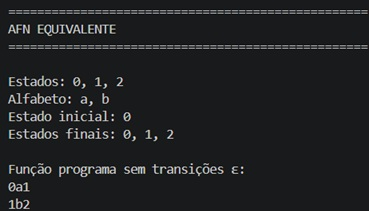

<table align="center">
<tr>

<td align="center" width="25%">

</td>

<td align="center" width="50%">

<strong>Universidade Federal do Maranhão (UFMA)</strong><br>
Centro de Ciências Exatas e Tecnologia<br>
Curso de Engenharia da Computação<br>
Disciplina: Linguagens Formais e Autômatos<br><br>

<strong>Discente:</strong><br>
Renata Costa Rocha

</td>

<td align="center" width="25%">

</td>

</tr>
</table>

<hr>

<h1 align="center">Transformação de AFε para AFN</h1>

<p align="center">
  <em>
    Implementação em Python do algoritmo de transformação de Autômato Finito com transições Épsilon (AFε)
    para Autômato Finito Não Determinístico (AFN) utilizando o cálculo do ε-fecho.
  </em>
</p>

<p align="center">
  
  
  
  
</p>

---

## 1. Descrição do Projeto

O presente projeto tem como objetivo implementar o algoritmo de transformação de um Autômato Finito com transições Épsilon (AFε) para um Autômato Finito Não Determinístico (AFN).

A aplicação realiza a leitura dos componentes do autômato, calcula o ε-fecho de cada estado e gera automaticamente o AFN equivalente sem transições ε.

O trabalho foi desenvolvido como atividade da disciplina de Linguagens Formais e Autômatos, permitindo a aplicação prática dos conceitos teóricos estudados em sala de aula.

---

## 2. Objetivo

O projeto tem como objetivo desenvolver uma ferramenta capaz de:

- Ler os estados do AFε;
- Ler o estado inicial;
- Ler a função programa;
- Ler os estados finais;
- Calcular o ε-fecho de cada estado;
- Remover as transições ε;
- Construir o AFN equivalente;
- Exibir o resultado da transformação.

---

## 3. Enunciado da Atividade

A atividade proposta na disciplina de Linguagens Formais e Autômatos consiste na implementação do algoritmo de transformação de um Autômato Finito com transições Épsilon (AFε) para um Autômato Finito Não Determinístico (AFN), respeitando as restrições definidas pelo enunciado.

<p align="center">
  
</p>

<p align="center">
  <em>Enunciado da atividade proposta para a 3ª avaliação.</em>
</p>

---

## 4. Restrições do Problema

O AFε de entrada possui:

- No máximo 5 estados;
- No máximo 7 transições;
- No máximo 3 símbolos do alfabeto.

---

## 5. Exemplo de Entrada

```text
Informe os estados do autômato:
0, 1, 2

Informe o estado inicial:
0

Informe a função programa:
0a1
0ε2
1b2

Informe os estados finais:
1, 2
```

---

## 6. Exemplo de Saída

```text
ε-fecho(0) = {0, 2}
ε-fecho(1) = {1}
ε-fecho(2) = {2}

AFN equivalente:

Estado inicial: 0

Estados finais:
1, 2

Transições:
0 a 1
0 b 2
1 b 2
```
---

## 7. Capturas de Tela

### Entrada do AFε

<p align="center">
  
</p>

<p align="center">
  <em>Leitura dos estados, estado inicial, função programa e estados finais.</em>
</p>

---

### AFε Original e Cálculo dos ε-Fechos

<p align="center">
  
</p>

<p align="center">
  <em>Exibição do autômato original e cálculo dos ε-fechos de cada estado.</em>
</p>

---

### AFN Equivalente

<p align="center">
  
</p>

<p align="center">
  <em>Resultado da transformação do AFε para o AFN equivalente.</em>
</p>

---

## 8. Fundamentação Teórica

Os Autômatos Finitos com transições Épsilon (AFε) permitem mudanças de estado sem o consumo de símbolos da cadeia de entrada.

Para eliminar as transições ε, calcula-se o ε-fecho de cada estado, que representa o conjunto de estados alcançáveis utilizando apenas transições ε.

A partir desses conjuntos, novas transições são construídas para gerar um Autômato Finito Não Determinístico equivalente, preservando a linguagem reconhecida pelo autômato original.

---

## 9. Tecnologias Utilizadas

- Python;
- Visual Studio Code (VS Code);
- Git;
- GitHub.

---

## 10. Estrutura do Projeto

```text
afe-afn/
│
├── main.py
├── README.md
├── ufma.png
├── logo.jpg
│
└── imagens/
    ├── enunciado.png
    ├── entrada.jpg
    ├── fechos.jpg
    └── afnequivalente.jpg
```

---

## 11. Como Executar

Clone o repositório:

```bash
git clone https://github.com/ahcorataner/afe-afn.git
```

Acesse a pasta do projeto:

```bash
cd afe-afn
```

Execute o programa:

```bash
python main.py
```

---

## 12. Funcionamento do Algoritmo

O algoritmo executa as seguintes etapas:

1. Leitura dos componentes do AFε;
2. Identificação das transições ε;
3. Cálculo do ε-fecho dos estados;
4. Construção das novas transições;
5. Determinação dos estados finais equivalentes;
6. Geração do AFN resultante.

---

## 13. Contribuição

A principal contribuição deste trabalho consiste na implementação computacional do algoritmo de transformação de um Autômato Finito com transições Épsilon (AFε) em um Autômato Finito Não Determinístico (AFN), permitindo a eliminação das transições ε e a obtenção de um autômato equivalente.

Além de demonstrar na prática o cálculo do ε-fecho e a construção do AFN resultante, o projeto reforça conceitos fundamentais da disciplina de Linguagens Formais e Autômatos, relacionados à representação, manipulação e equivalência de autômatos finitos.

---

## 14. Trabalhos Futuros

- Implementação da transformação AFN → AFD;
- Minimização de AFD;
- Validação de cadeias de entrada;
- Interface gráfica para construção de autômatos;
- Exportação de diagramas dos autômatos.

---

## 15. Licença

Este projeto possui finalidade acadêmica e foi desenvolvido no contexto da disciplina de Linguagens Formais e Autômatos do curso de Engenharia da Computação da Universidade Federal do Maranhão (UFMA).

O código-fonte, a documentação e os materiais disponibilizados neste repositório destinam-se exclusivamente a fins educacionais, de estudo e pesquisa.

---

<h2>14. Contato</h2>

<p>
Para dúvidas, sugestões ou informações relacionadas ao projeto:
</p>

<p>
<strong>Renata Costa Rocha</strong><br>
📧 renata.rocha@discente.ufma.br<br>
Universidade Federal do Maranhão (UFMA)<br>
Curso de Engenharia da Computação
</p>